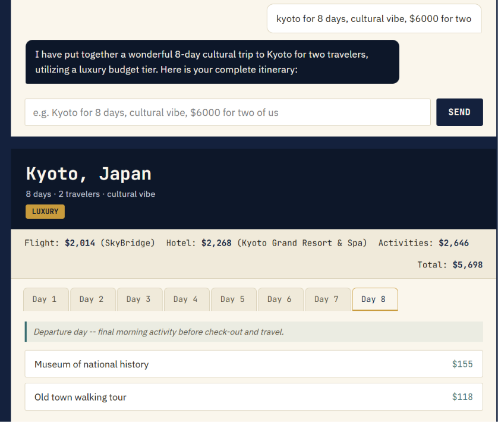
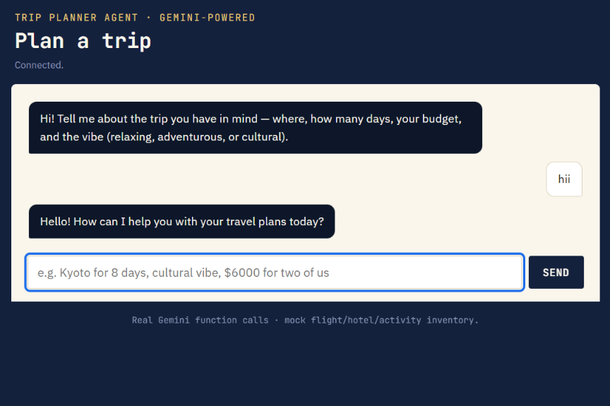
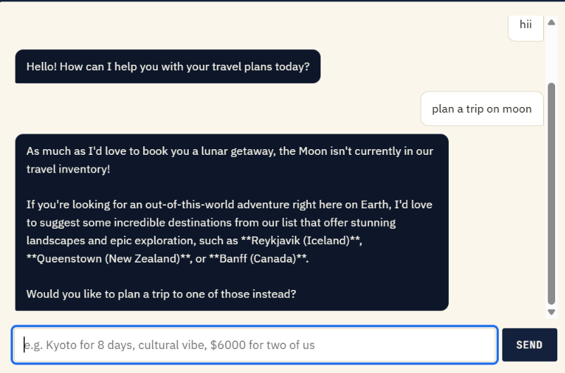

# Trip Planner Agent

An AI travel-planning agent that asks a few clarifying questions (budget, dates, vibe), calls tools to search flights/hotels/activities, and returns a structured day-by-day itinerary — built two ways: a deterministic, eval-tested version and a live Gemini-powered version with real function calling.

**🔗 Live demo:** [trip-planner-agent-obqn.onrender.com](https://trip-planner-agent-obqn.onrender.com)
*(free-tier hosting — first load after a period of inactivity can take ~30-50s while the server wakes up)*



## Two versions, on purpose

This repo has both a deterministic agent and an LLM-powered one, and that's deliberate — not left-over scaffolding.

| | Deterministic agent | Gemini-powered agent |
|---|---|---|
| Files | `agent.py`, `dashboard.html` | `app.py`, `mock_inventory.py`, `tools.py`, `validators.py`, `static/index.html` |
| Logic | Rule-based Python, regex-parsed chat | Real Gemini function calling |
| Guardrails | Hardcoded destination list | Gemini's own reasoning + inventory check |
| Testability | 100% reproducible — same input, same output, every time | Nondeterministic, validated at runtime |
| Proof | `eval_suite.py` — 15 personas, 141 automated checks | `validators.py` — same rule set, applied live |

The deterministic version exists so the core logic (budget tiers, vibe pacing, "no contradictory suggestions") is fully testable and provable — see [Eval results](#eval-results) below. The Gemini version reuses that *exact same rule set* as a live guardrail: if Gemini's itinerary breaks a pacing or budget-tier rule, the server catches it and asks Gemini to fix it before the person ever sees it — up to 2 automatic correction attempts.

## How it works

1. **Ask** — collects destination, trip length, budget, travelers, and vibe (relaxing / adventurous / cultural), asking only for whatever's still missing
2. **Guard** — checks the destination is real and bookable before anything else runs (a moon trip gets a graceful redirect, not a hallucinated itinerary)
3. **Search** — calls tools for flights, hotels, and activities, scoped to the right budget tier
4. **Build** — assembles a day-by-day plan: arrival/departure days get lighter schedules, activity count matches the vibe's pace (relaxing = 2/day, adventurous = 4/day, cultural = 3/day)

## Eval results

```
$ python3 eval_suite.py
...
Summary: 141/141 checks passed across 15 personas.
RESULT: PASS
```

15 personas span solo backpackers, families, honeymoon couples, and deliberately adversarial cases (an impossible "Moon" trip, an incomplete brief). Checks cover response correctness, budget-tier accuracy, vibe pacing, and that hotel tier / flight class / activity prices never contradict each other. Full report: [`eval_report.md`](eval_report.md).

## Screenshots

| Chat mode | Guardrail | Itinerary |
|---|---|---|
|  |  |  |

## Tech stack

- **Backend:** FastAPI, Google Gen AI SDK (`google-genai`), Gemini function calling
- **Frontend:** Vanilla HTML/CSS/JS, no build step — day-tabs itinerary view follows the [WAI-ARIA Tabs Pattern](https://www.w3.org/WAI/ARIA/apg/patterns/tabs/) (keyboard navigable, screen-reader tested)
- **Deterministic agent:** Python, no external dependencies
- **Hosting:** Render (free tier)

## Project structure

```
agent.py               Deterministic agent — guardrails, budget tiers, mock search tools
eval_suite.py           15-persona eval suite, 141 automated checks
personas.py             The 15 test personas
dashboard.html          Interactive dashboard for the deterministic agent (form + chat modes)
design-system.md        Design tokens and accessibility patterns
eval_report.md          Latest eval run output

app.py                  FastAPI server — Gemini chat sessions, tool calling, itinerary validation
mock_inventory.py       Shared mock flight/hotel/activity data
tools.py                Gemini-facing tool functions (function calling schema via docstrings)
validators.py           Runtime version of the eval suite's pacing/budget checks
static/index.html       Chat frontend for the Gemini-powered agent
requirements.txt        Python dependencies
render.yaml             Render deployment blueprint
README_DEPLOY.md         Full local-run + Render deployment guide
```

## Running locally

**Deterministic agent:**
```bash
python3 eval_suite.py          # run the eval suite
python3 -c "from agent import TripPlannerAgent; ..."   # or open dashboard.html directly
```

**Gemini-powered agent:**
```bash
pip install -r requirements.txt
export GEMINI_API_KEY=your-key-here    # get one at https://aistudio.google.com/apikey
uvicorn app:app --reload
# open http://localhost:8000
```

Full deployment instructions (including one-click Render setup) are in [`README_DEPLOY.md`](README_DEPLOY.md).

## What this project demonstrates

- **Eval-driven iteration** — the eval suite caught two real bugs during development (a math error in test data, and a genuine agent gap where tiny budgets could silently exceed the stated total), not just confirmed things worked
- **Guardrails against nonsense input** — both versions handle impossible destinations and infeasible budgets gracefully instead of hallucinating past them
- **Accessible design** — WAI-ARIA-compliant keyboard navigation, skip links, focus management, `aria-live` regions, `prefers-reduced-motion` support
- **LLM tool use in production shape** — real function calling, with the same correctness rules that govern the deterministic version enforced as a live runtime guardrail on nondeterministic output

---

Built by Manvitha — final-year B.Tech CSE, Hindustan Institute of Technology and Science.
